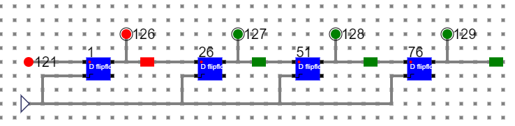

# Components :

To build any register or counters, we need :
1. Flip-Flops.
2. Logic Gates.
3. Wires to connect.
In case of counters the number of flip-flops depends on the number of different states in the counter.

# Circuit 4 bit shift register(SISO):

# Circuit of D Flip Flop:

- Follow the below manual and perform the experiment
    - Manual --> [Click Here](./simulation/coavlNew.pdf)

<embed src="./simulation/coavlNew.pdf" type="application/pdf">

