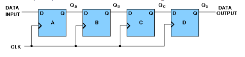

## Theory

## Design of Registers and Counterss :

In a sequential circuit the present output is determined by both the present input and the past output. In order to receive the past output some kind of memory element can be used. The memory element commonly used in the sequential circuits are time-delay devices. The block diagram of the sequential circuit-

A circuit with flip-flops is considered a sequential circuit even in the absence of combinational logic. Circuits that include flip-flops are usually classified by the function they perform. Two such circuits are registers and counters:
1. **Register** is a group of flip-flops. Its basic function is to hold information within a digital system so as to make it available to the logic units during the computing process.
2. **Counter** is essentially a register that goes through a predetermined sequence of states.

There are various different kind of **Flip-Flops**. Some of the common flip-flops are: R-S Flip-Flop, D Flip-Flop, J-K Flip-Flop, T Flip-Flop. The block diagram of different flip-flops are shown here -

- **RS flipflop** If R is high then reset state occurs and when S=1 set state.the both cannot be high simultaneouly. this input combination is avoided.

- **JK flipflop** If J and K are both low then no change occurs. If J and K are both high at the clock edge then the output will toggle from one state to the other.

- **D flipflop** The D flip-flop tracks the input, making transitions with match those of the input D. It is used as data store.

- **Tflipflop** The T or "toggle" flip-flop changes its output on each clock edge

## Types of Registers:

- **4-bit Serial-in Serial-out**

4 bit serial-in serial-out register accepts digital data serially that is one bit at the time on one line. It produces the stored information on its output also in serial form. This is a shift register, as The binary number is "Shifted" one bit at time from one flip flop to the next. The block diagram is-

- **4-bit Serial-in Parallel-out**

In serial-in parallel-out register the data are loaded serially and read out in parallel. The block diagram is-

- **4-bit Parallel-in Serial-out**

In parallel-in serial out register the bits are entered simultaneously into their respective stages on parallel-lines, rather than on a bit-by-bit basis on one line as with serial data inputs and output is read out out parallaly. The block diagram is-

- **4-bit Parallel-in Parallel-out**

In parallel-in parallel out register the data is loaded in parallel and shifted out serially. The block diagram is-

## Types of Counters:

- **4-bit Synchronous Binary Counter**

A counter is a sequential circuit that moves through a predefined sequence of states upon applying of clock pulses. The sequence of states may follow the binary number sequence or an arbitrary manner (no sequence). The simplest example of a counter is the binary counter which follows the binary number sequence. An n-bit binary counter contains n flip-flops and can count binary numbers from 0 to (2n -1)(up counter which is incremental, if it counts decrementally it is then down counter). logic diagram of 4 bit synchronous counter-

- **4-bit Synchronous Ring Counter**

If the output of a shift register is fed back to the input. a ring counter results. The data pattern contained within the shift register will recirculate as long as clock pulses are applied. logic diagram of synchronous ring counter-

Timing diagram:

- **4-bit Synchronous Johnson Counter**

If the complement output of a ring counter is fed back to the input instead of the true output, a Johnson counter results. This "reversed" feedback connection has a profound effect upon the behavior of the otherwise similar circuits. Recirculating a single 1 around a ring counter divides the input clock by a factor equal to the number of stages. Whereas, a Johnson counter divides by a factor equal to twice the number of stages. logic diagram of synchronous Johnson counter-

Timing Diagram-

## Design Issues:

The four different types of flip-flops are supplied here. One can easily build any register or counter using those flip-flop and different logic gates. But the clock input is under development, so it is not possible now to build any register or counter completely.
